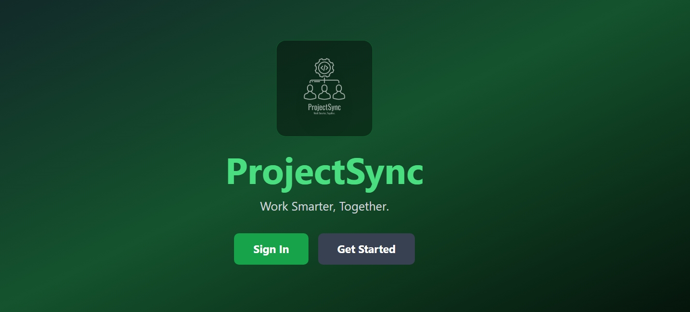
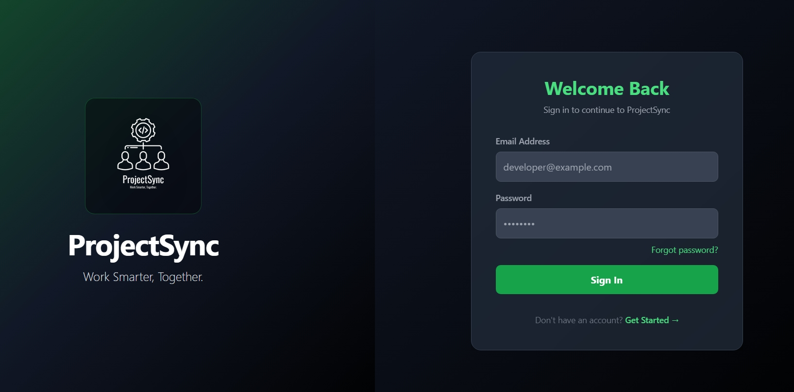
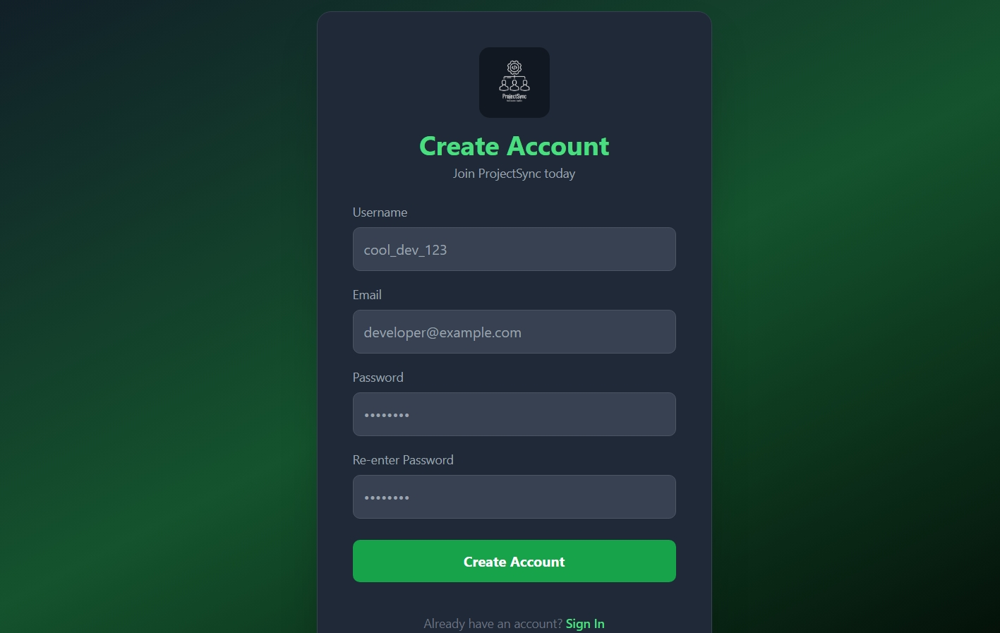
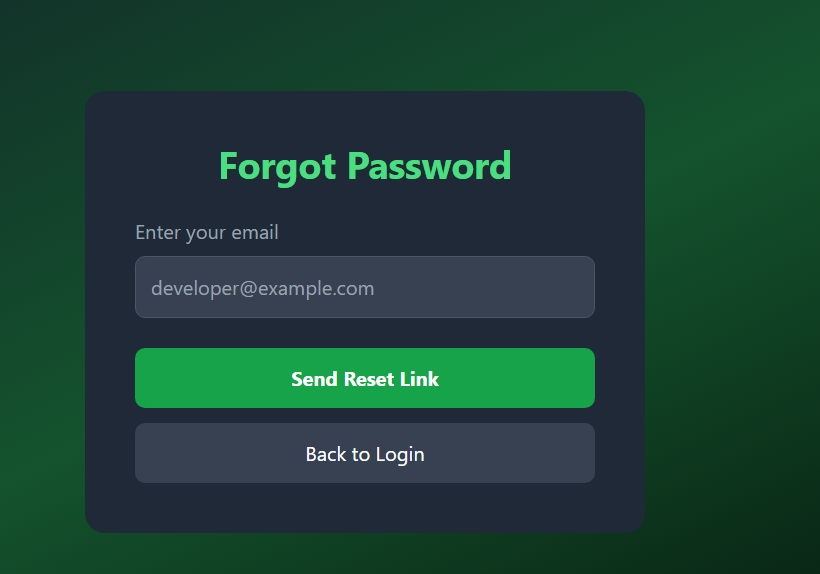
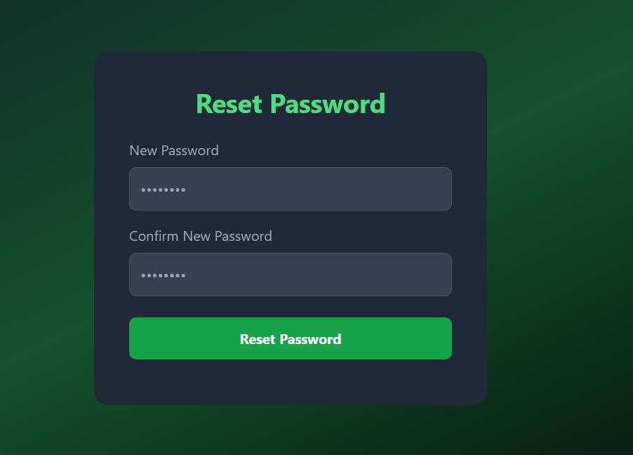
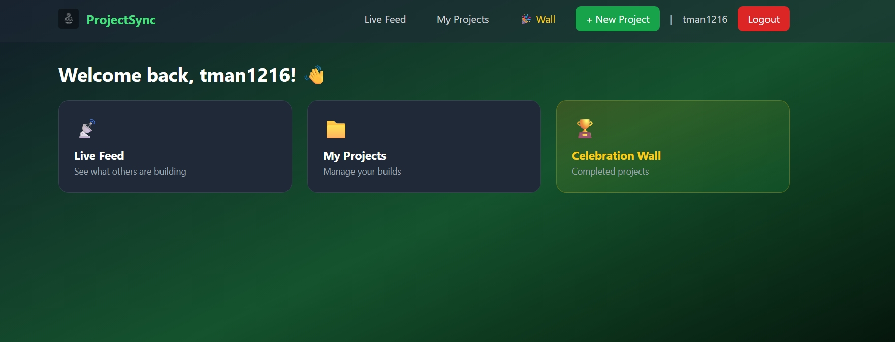
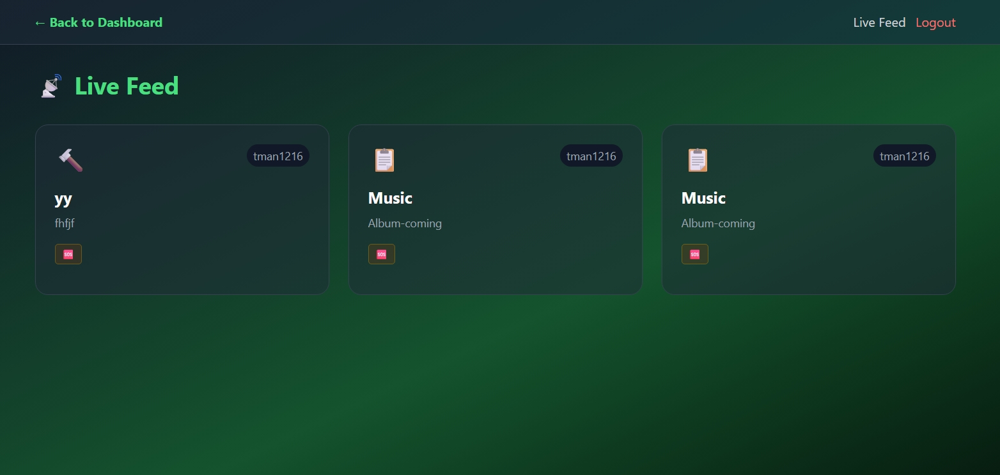
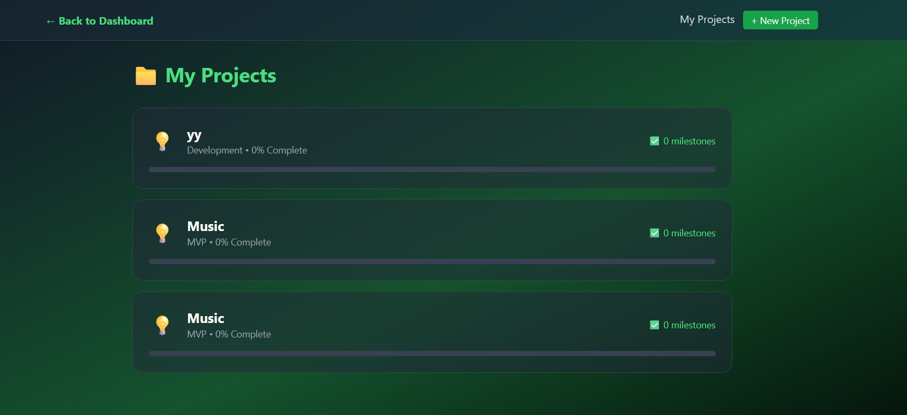

# 🚀 ProjectSync

**Work Smarter, Together** 


### 🔐 Authentication
| Frontpage |
|-------|
|  

| Login | Register |
|-------|----------|
|  |  |

### 📧 Password Reset

| Reset Email | Reset Form |
|-------------|------------|
|  |  |

### 🏠 Main Application

| Dashboard | Live Feed | My Projects |
|-----------|-----------|-------------|
|  |  |  |

## ✨ Features

- 📡 **Live Feed** - Real-time project updates from other developers
- 📁 **Project Management** - Create, track, and manage your projects
- 🎯 **Milestones** - Add achievements as you make progress
- 🤝 **Collaboration** - Request help and collaborate with other developers
- 🏆 **Celebration Wall** - Get recognized when you ship your project
- 🔐 **Secure Authentication** - JWT-based login and registration
- 📧 **Password Reset** - Email-based password recovery

## 🛠️ Tech Stack

| Layer | Technology |
|-------|------------|
| **Frontend** | React 18, Tailwind CSS |
| **Backend** | Node.js, Express |
| **Database** | MongoDB with Mongoose |
| **Real-time** | Socket.IO |
| **Authentication** | JWT, Bcrypt |
| **Email** | Nodemailer |

## 🚀 Live Demo

- **Frontend**: https://projectsync.vercel.app
- **Backend API**: https://projectsync-aevd.onrender.com

## 📦 Installation


Executive Summary
ProjectSync is a full-stack web application designed to facilitate collaborative project development among software developers. The platform embodies the "Build in Public" philosophy, allowing developers to share their work-in-progress, solicit feedback, find collaborators, and celebrate project completions. The application consists of a Node.js backend with real-time capabilities and a React frontend, both designed to work seamlessly together to provide an interactive user experience.
The primary value proposition of ProjectSync is that it transforms solitary coding into a social experience. Rather than working in isolation, developers can broadcast their progress, receive encouragement during difficult phases, and potentially find partners who can help overcome technical challenges. The platform supports the entire project lifecycle from initial concept through completion, with special emphasis on the community aspects of software development.


```bash
# Clone the repository
git clone https://github.com/Thilitshi/ProjectSync.git
cd ProjectSync

# Backend setup
cd backend
npm install
npm run dev

# Frontend setup (new terminal)
cd frontend
npm install
npm start
